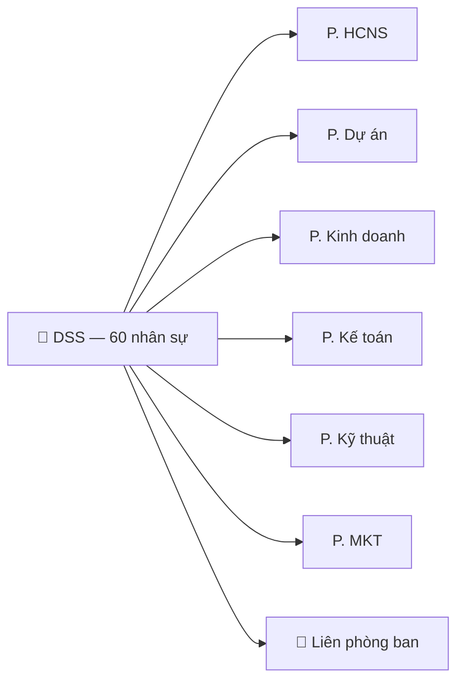

---
{"dg-publish":true,"permalink":"/01-projects/dss-corp/dss-process-map/"}
---

# BẢN ĐỒ QUY TRÌNH CHUYỂN ĐỔI SỐ — DSS

> **Mục đích:** Liệt kê tất cả quy trình công việc đang vận hành trong 6 phòng ban, chỉ rõ cách làm hiện tại, vấn đề đang gặp, và giải pháp số hóa trên Lark Suite.
> **Đây là bản đồ quy trình để cả công ty cùng hình dung: "Chuyển đổi số nghĩa là chuyển đổi CÁI GÌ".

---

## TỔNG QUAN

| Tổng số quy trình nhận diện | Mức độ ưu tiên                      |
| --------------------------- | ----------------------------------- |
| **32 quy trình**            | 🔴 Cao: 12 · 🟡 TB: 12 · 🟢 Thấp: 8 |

---

## I. PHÒNG HCNS — Hành chính Nhân sự

> 🎯 **Discovery đầu tiên** — Phòng ban có nhiều pain point nhất, ảnh hưởng trực tiếp đến toàn bộ 60 nhân viên.

### QT-01. Chấm công & Quản lý ca kíp 🔴

| Yếu tố              | Chi tiết                                                                                                         |
| ------------------- | ---------------------------------------------------------------------------------------------------------------- |
| **Hiện tại**        | Máy chấm công (PM free) → Xuất Excel → Kiểm tra thủ công                                                         |
| **Vấn đề**          | Mất 3-5 ngày/tháng để xuất + kiểm tra data. Không track được đi trễ real-time. NV đi công trình không chấm được. |
| **Giải pháp Lark**  | **Lark Attendance** — Chấm công qua App/Wifi/GPS. Ca kíp tự xoay. Data chạy thẳng vào Base.                      |
| **Kết quả kỳ vọng** | Từ 3-5 ngày → **0 ngày** chốt công tự động                                                                       |

### QT-02. Tính lương hàng tháng 🔴

| Yếu tố              | Chi tiết                                                                                                   |
| ------------------- | ---------------------------------------------------------------------------------------------------------- |
| **Hiện tại**        | Xuất data Chấm công → Copy sang Excel lương → Tính tay (CB + phụ cấp + OT + KPI − khấu trừ) → Gửi Kế toán  |
| **Vấn đề**          | Dễ nhầm ngày công, sai OT, quên trừ nghỉ không phép. Mỗi tháng mất 3-5 ngày.                               |
| **Giải pháp Lark**  | **Lark Base** — Bảng lương với công thức tự động. Data chấm công chạy thẳng vào, KPI từ trưởng phòng nhập. |
| **Kết quả kỳ vọng** | Từ 3-5 ngày → **nửa ngày** review & xác nhận                                                               |

### QT-03. Quản lý hồ sơ nhân sự 🔴

| Yếu tố              | Chi tiết                                                                                           |
| ------------------- | -------------------------------------------------------------------------------------------------- |
| **Hiện tại**        | Hồ sơ giấy + Excel rời. Tra cứu 1 NV mất nhiều phút. Không biết HĐ ai sắp hết hạn.                 |
| **Vấn đề**          | Rủi ro mất hồ sơ. Không có cảnh báo HĐ hết hạn. Khó tổng hợp báo cáo nhân sự cho GĐ.               |
| **Giải pháp Lark**  | **Lark Base (HR Database)** — 1 bảng master chứa toàn bộ thông tin NV. Automation nhắc HĐ hết hạn. |
| **Kết quả kỳ vọng** | Tra cứu 1 NV: **5 giây**. Cảnh báo HĐ tự động trước 30 ngày.                                       |

### QT-04. Đơn từ & Phê duyệt 🟡

| Yếu tố | Chi tiết |
|---------|----------|
| **Hiện tại** | NV nhắn Zalo/viết giấy → Sếp duyệt miệng → HCNS cập nhật tay vào Excel |
| **Vấn đề** | Không lưu vết. Sếp quên duyệt. HCNS quên cập nhật phép. Không biết còn bao nhiêu ngày phép. |
| **Giải pháp Lark** | **Lark Approval** — NV bấm 1 chạm trên App → Tự chạy theo cấp duyệt → Tự trừ phép. |
| **Kết quả kỳ vọng** | Duyệt tức thì trên điện thoại. Lịch sử 100% truy vết. |

### QT-05. Tuyển dụng & Onboarding 🟢

| Yếu tố | Chi tiết |
|---------|----------|
| **Hiện tại** | Đăng Facebook/TopCV → Nhận CV qua mail/Zalo → Phỏng vấn → Ký HĐ giấy |
| **Vấn đề** | Không track được bao nhiêu CV, tỷ lệ pass, thời gian tuyển. Onboarding bị bỏ sót bước. |
| **Giải pháp Lark** | **Lark Base (Recruitment Pipeline)** + **Checklist Onboarding trên Task** |
| **Kết quả kỳ vọng** | Biết tỷ lệ tuyển, NV mới không bị bỏ rơi ngày đầu |

### QT-06. Bảo hiểm & Chế độ 🟢

| Yếu tố | Chi tiết |
|---------|----------|
| **Hiện tại** | Track BHXH/BHYT trên Excel riêng. Thủ tục nghỉ thai sản, tai nạn lao động xử lý tay. |
| **Vấn đề** | Dễ quên đóng, sai số liệu, thiếu lịch sử. |
| **Giải pháp Lark** | **Lark Base** — Bảng BHXH liên kết với HR Database. Automation nhắc kỳ đóng. |
| **Kết quả kỳ vọng** | Không bỏ sót, lịch sử rõ ràng |

---

## II. PHÒNG DỰ ÁN

> 🎯 **Discovery thứ hai** — Phòng ban tạo doanh thu chính, liên kết chặt với Kỹ thuật + KD + Kế toán.

### QT-07. Tiếp nhận & Khảo sát công trình 🟡

| Yếu tố | Chi tiết |
|---------|----------|
| **Hiện tại** | KD chuyển yêu cầu qua Zalo → PM lên lịch khảo sát → Chụp ảnh + ghi chép tay |
| **Vấn đề** | Thông tin khảo sát rời rạc, ảnh lưu trên điện thoại cá nhân, dễ thất lạc. |
| **Giải pháp Lark** | **Lark Base (Project Database)** — Record mới per dự án + folder Drive lưu ảnh/tài liệu |
| **Kết quả kỳ vọng** | Mọi data khảo sát tập trung 1 nơi, không mất khi NV nghỉ |

### QT-08. Thiết kế & Báo giá dự án 🟡

| Yếu tố | Chi tiết |
|---------|----------|
| **Hiện tại** | Word/Excel → Sếp duyệt miệng/Zalo → Gửi khách |
| **Vấn đề** | Không có template chuẩn. Không track version báo giá. Không biết margin dự kiến. |
| **Giải pháp Lark** | **Lark Docs (Template)** + **Base** lưu lịch sử báo giá, liên kết giá vốn từ danh mục sản phẩm |
| **Kết quả kỳ vọng** | Báo giá chuẩn form, biết margin trước khi ký HĐ |

### QT-09. Quản lý tiến độ thi công 🔴

| Yếu tố | Chi tiết |
|---------|----------|
| **Hiện tại** | Excel hoặc nhớ trong đầu. Báo cáo qua nhóm Zalo. GĐ muốn biết tình hình phải hỏi từng PM. |
| **Vấn đề** | Delay phát hiện muộn. Không có Gantt chart. Tổng hợp tất cả DA cho GĐ mất cả ngày. |
| **Giải pháp Lark** | **Lark Base** — Bảng dự án với Timeline/Gantt view. Status tự cập nhật. Dashboard roll-up cho GĐ. |
| **Kết quả kỳ vọng** | GĐ mở 1 màn hình thấy tất cả DA xanh/đỏ |

### QT-10. Phân công nhân sự thi công 🟡

| Yếu tố | Chi tiết |
|---------|----------|
| **Hiện tại** | PM gọi Zalo cho trưởng nhóm kỹ thuật → Phân người tay |
| **Vấn đề** | Xung đột lịch (2 DA cần cùng 1 thợ). Không biết ai đang rảnh. |
| **Giải pháp Lark** | **Lark Base** — Bảng nhân sự kỹ thuật liên kết với bảng DA → biết ai đang ở đâu |
| **Kết quả kỳ vọng** | Phân công có dữ liệu, không trùng lịch |

### QT-11. Quản lý vật tư & Xuất kho dự án 🔴

| Yếu tố | Chi tiết |
|---------|----------|
| **Hiện tại** | Phiếu xuất kho giấy hoặc Excel. Không track tồn kho theo dự án. Thiếu vật tư giữa chừng → delay. |
| **Vấn đề** | Không biết tồn kho real-time. Không biết DA nào đã xuất bao nhiêu vật tư. Hao hụt khó kiểm soát. |
| **Giải pháp Lark** | **Lark Base (Inventory)** — Bảng xuất nhập kho liên kết với bảng DA. Automation cảnh báo tồn kho thấp. |
| **Kết quả kỳ vọng** | Biết tồn kho real-time, biết chi phí vật tư per dự án |

### QT-12. Nghiệm thu & Bàn giao 🟡

| Yếu tố | Chi tiết |
|---------|----------|
| **Hiện tại** | Biên bản giấy → Ký → Scan/chụp → Lưu đâu đó |
| **Vấn đề** | Tìm biên bản cũ mất thời gian. Không link với record dự án. |
| **Giải pháp Lark** | **Lark Approval** nghiệm thu + Drive lưu ảnh → link với record DA |
| **Kết quả kỳ vọng** | 1 click tìm toàn bộ hồ sơ DA |

### QT-13. Bảo hành dự án 🟡

| Yếu tố | Chi tiết |
|---------|----------|
| **Hiện tại** | Khách gọi Zalo/SĐT → Ai đó tiếp nhận → Cử thợ đi. Không track thời hạn BH. |
| **Vấn đề** | Không biết DA nào đang còn BH. Khách gọi nhiều lần cho cùng 1 lỗi mà không biết. |
| **Giải pháp Lark** | **Lark Base (Warranty Tracker)** — Liên kết với bảng DA. Automation nhắc hết BH. |
| **Kết quả kỳ vọng** | Track được lịch sử BH, biết DA nào sắp hết hạn |

### QT-14. Đối soát chi phí dự án 🔴

| Yếu tố | Chi tiết |
|---------|----------|
| **Hiện tại** | Cuối DA, HCNS/PM gom hóa đơn + phiếu xuất kho → So với báo giá ban đầu |
| **Vấn đề** | Phát hiện lỗ/lãi MUỘn (khi đã xong DA). File nằm rải rác. |
| **Giải pháp Lark** | **Lark Base** — Chi phí tích lũy real-time (vật tư + nhân công) vs báo giá. Dashboard per DA. |
| **Kết quả kỳ vọng** | Biết lãi/lỗ ngay giữa chừng DA, kịp điều chỉnh |

---

## III. PHÒNG KINH DOANH

> 🎯 **Discovery giai đoạn 2** — Phòng tạo deal, cần pipeline rõ ràng.

### QT-15. Quản lý khách hàng (CRM) 🔴

| Yếu tố | Chi tiết |
|---------|----------|
| **Hiện tại** | Mỗi sales lưu khách trên điện thoại/Zalo cá nhân. Nhân viên nghỉ → mất khách. |
| **Vấn đề** | Không biết đang có bao nhiêu khách. Overlap 2 sales tiếp cùng 1 khách. Không lịch sử chăm sóc. |
| **Giải pháp Lark** | **Lark Base (CRM)** — Database Khách hàng tập trung. Lịch sử follow-up per client. |
| **Kết quả kỳ vọng** | Khách hàng là tài sản công ty, không phải tài sản cá nhân |

### QT-16. Pipeline bán hàng & Deal tracking 🔴

| Yếu tố | Chi tiết |
|---------|----------|
| **Hiện tại** | Báo cáo bán hàng miệng hoặc Excel cá nhân. GĐ không biết tổng pipeline. |
| **Vấn đề** | Không biết deal nào đang ở giai đoạn nào. Không forecast doanh thu. |
| **Giải pháp Lark** | **Lark Base** — Kanban Pipeline: Tiếp cận → Báo giá → Thương lượng → Ký HĐ → Thu tiền |
| **Kết quả kỳ vọng** | GĐ thấy pipeline & forecast doanh thu real-time |

### QT-17. Quản lý đơn hàng phân phối 🟡

| Yếu tố | Chi tiết |
|---------|----------|
| **Hiện tại** | Đơn hàng qua Zalo/điện thoại → Ghi Excel → Chuyển kho xuất |
| **Vấn đề** | Dễ sót đơn. Không track trạng thái giao hàng. |
| **Giải pháp Lark** | **Lark Base (Order Management)** — Từ tạo đơn → Duyệt → Xuất kho → Giao → Xác nhận |
| **Kết quả kỳ vọng** | Không sót đơn, biết trạng thái giao real-time |

### QT-18. Chăm sóc sau bán hàng 🟢

| Yếu tố              | Chi tiết                                                             |
| ------------------- | -------------------------------------------------------------------- |
| **Hiện tại**        | Thiếu hệ thống. Khách gọi ai thì người đó xử lý.                     |
| **Vấn đề**          | Không biết khách nào hay gặp vấn đề. Không có lịch chăm sóc định kỳ. |
| **Giải pháp Lark**  | **Lark Base** — Lịch sử ticket + Automation nhắc lịch follow-up      |
| **Kết quả kỳ vọng** | CSKH chủ động, tăng tái mua                                          |

---

## IV. PHÒNG KẾ TOÁN

> 🎯 **Discovery giai đoạn 2** — Giữ Misa làm phần mềm lõi, Lark đóng vai trò đối soát & kết nối data.

### QT-19. Công nợ khách hàng 🔴

| Yếu tố              | Chi tiết                                                                                                  |
| ------------------- | --------------------------------------------------------------------------------------------------------- |
| **Hiện tại**        | Excel/Misa riêng. KD và KT đối chiếu thủ công.                                                            |
| **Vấn đề**          | Số liệu KD vs KT hay cần đối soát hàng ngày.                                                              |
| **Giải pháp Lark**  | **Lark Base (AR Tracker)** — Link với CRM/Order → KT xác nhận thanh toán → Tự cập nhật trạng thái công nợ |
| **Kết quả kỳ vọng** | KD & KT nhìn cùng 1 con số. Cảnh báo nợ quá hạn tự động.                                                  |

### QT-20. Công nợ nhà cung cấp 🟡

| Yếu tố              | Chi tiết                                                                       |
| ------------------- | ------------------------------------------------------------------------------ |
| **Hiện tại**        | KT track trên Misa/Excel. Không/chưa liên kết với đơn mua hàng.                |
| **Vấn đề**          | Không biết tổng nợ NCC real-time. Dễ quên hạn thanh toán.                      |
| **Giải pháp Lark**  | **Lark Base (AP Tracker)** — Liên kết đơn mua hàng → Hạn thanh toán → Nhắc nhở |
| **Kết quả kỳ vọng** | Không quá hạn thanh toán NCC                                                   |

### QT-21. Thu chi nội bộ & Tạm ứng 🟡

| Yếu tố | Chi tiết |
|---------|----------|
| **Hiện tại** | Giấy đề xuất → Sếp ký → KT chi → NV hoàn ứng (hoặc quên) |
| **Vấn đề** | Tạm ứng không hoàn. Mất chứng từ. Không track được dòng tiền nhỏ lẻ. |
| **Giải pháp Lark** | **Lark Approval** (đề xuất chi) + **Base** (track tạm ứng & hoàn ứng) |
| **Kết quả kỳ vọng** | Mọi khoản chi có dấu vết. NV tự biết mình đang nợ bao nhiêu. |

### QT-22. Đối soát doanh thu — chi phí theo dự án 🔴

| Yếu tố | Chi tiết |
|---------|----------|
| **Hiện tại** | KT gom số từ KD + DA + Kho → Đối chiếu thủ công cuối tháng/quý |
| **Vấn đề** | Mất nhiều ngày. Sai sót do nhập tay. GĐ không có số real-time. |
| **Giải pháp Lark** | Dữ liệu từ Base DA + CRM + Kho tự aggregate → **Dashboard** doanh thu/chi phí |
| **Kết quả kỳ vọng** | GĐ xem P&L tổng quan bất cứ lúc nào trên điện thoại |

### QT-23. Báo cáo tài chính tổng hợp 🟢

| Yếu tố | Chi tiết |
|---------|----------|
| **Hiện tại** | Misa xuất → KT chỉnh format → Gửi GĐ |
| **Vấn đề** | Giữ nguyên quy trình này, Misa vẫn là nguồn chính. |
| **Giải pháp Lark** | Giữ Misa cho kế toán thuế. Lark chỉ làm **dashboard quản trị** bổ sung. |
| **Kết quả kỳ vọng** | GĐ có 2 view: Misa (thuế) + Lark (vận hành) |

---

## V. PHÒNG KỸ THUẬT

> 🎯 **Discovery giai đoạn 3** — Đội ngũ ngoài hiện trường, cần giải pháp mobile-first.

### QT-24. Quản lý đội thợ / kỹ thuật viên 🟡

| Yếu tố | Chi tiết |
|---------|----------|
| **Hiện tại** | Trưởng nhóm nhớ ai rảnh, ai bận. Giao việc qua Zalo. |
| **Vấn đề** | Xung đột lịch. Không biết năng lực từng thợ. Không track hiệu suất. |
| **Giải pháp Lark** | **Lark Base** — Danh sách KTV + Skills matrix + Lịch công tác (Calendar view) |
| **Kết quả kỳ vọng** | Phân công có data, không trùng lịch |

### QT-25. Phân công & Lịch thi công 🔴

| Yếu tố | Chi tiết |
|---------|----------|
| **Hiện tại** | PM gọi trưởng kỹ thuật → Trưởng nhóm giao Zalo → Thợ nhận việc |
| **Vấn đề** | Chuỗi giao việc dài, dễ sai lệch thông tin. Thợ không biết chi tiết công trình trước. |
| **Giải pháp Lark** | **Lark Messenger** nhóm dự án + **Task** phân công rõ deadline → Push notification |
| **Kết quả kỳ vọng** | Thợ nhận thông tin đầy đủ, biết đi đâu làm gì |

### QT-26. Báo cáo hiện trường 🟡

| Yếu tố | Chi tiết |
|---------|----------|
| **Hiện tại** | Thợ chụp ảnh → Gửi Zalo nhóm → PM tự lưu (hoặc không lưu) |
| **Vấn đề** | Ảnh công trình trôi trong Zalo. Không có template báo cáo. |
| **Giải pháp Lark** | **Bot** nhận ảnh + note → tự lưu vào Drive dự án + cập nhật Base |
| **Kết quả kỳ vọng** | Mọi ảnh hiện trường được lưu trữ có hệ thống |

### QT-27. Quản lý thiết bị & công cụ 🟢

| Yếu tố              | Chi tiết                                                             |
| ------------------- | -------------------------------------------------------------------- |
| **Hiện tại**        | Thợ tự quản lý đồ nghề. Công ty cấp nhưng thiếu track.               |
| **Vấn đề**          | Mất mát, hư hỏng không biết. Không biết cần mua bổ sung.             |
| **Giải pháp Lark**  | **Lark Base (Asset Tracker)** — Thiết bị nào ai đang giữ, tình trạng |
| **Kết quả kỳ vọng** | Biết tổng tài sản công cụ, lên kế hoạch mua sắm có căn cứ            |

---

## VI. PHÒNG MARKETING

> 🎯 **Discovery cuối cùng** — Quy mô nhỏ, impact trực tiếp thấp nhưng hỗ trợ KD.

### QT-28. Quản lý content & kênh marketing 🟢

| Yếu tố | Chi tiết |
|---------|----------|
| **Hiện tại** | Đăng bài Facebook/Website → Tự quản lý |
| **Giải pháp Lark** | **Lark Base (Content Calendar)** — Lịch đăng bài, tracking tương tác |
| **Kết quả kỳ vọng** | Đăng bài có kế hoạch, không bị bỏ sót |

### QT-29. Quản lý chiến dịch & Event 🟢

| Yếu tố | Chi tiết |
|---------|----------|
| **Hiện tại** | Ad-hoc, không track ROI |
| **Giải pháp Lark** | **Lark Base** — Budget + Timeline + KPI per chiến dịch |
| **Kết quả kỳ vọng** | Biết chiến dịch nào hiệu quả |

### QT-30. Tracking leads từ marketing 🟡

| Yếu tố | Chi tiết |
|---------|----------|
| **Hiện tại** | Khách inbox → MKT chuyển cho KD qua Zalo → Không biết kết quả |
| **Vấn đề** | Không đo được lead → deal conversion. MKT không biết mình đang tạo giá trị gì. |
| **Giải pháp Lark** | **Lark Base** — Lead log liên kết với CRM → Track từ nguồn → deal |
| **Kết quả kỳ vọng** | Biết kênh MKT nào mang về tiền |

---

## VII. QUY TRÌNH LIÊN PHÒNG BAN (Cross-functional)

### QT-31. Giao tiếp & Trao đổi nội bộ 🔴

| Yếu tố | Chi tiết |
|---------|----------|
| **Hiện tại** | Zalo cá nhân — NV nghỉ = mất toàn bộ data trao đổi, file, lịch sử |
| **Giải pháp Lark** | **Lark Messenger** — Org chart → Group chat chính thức → Data thuộc công ty |
| **Kết quả kỳ vọng** | Thông tin không trôi, NV nghỉ cắt quyền 1 cú click |

### QT-32. Lưu trữ & Chia sẻ tài liệu 🟡

| Yếu tố | Chi tiết |
|---------|----------|
| **Hiện tại** | Máy cá nhân + USB + Google Drive lẻ tẻ |
| **Giải pháp Lark** | **Lark Drive** — Phân quyền theo phòng ban, version control |
| **Kết quả kỳ vọng** | 1 nơi lưu trữ, phân quyền rõ ràng |

---

## TỔNG HỢP — THỨ TỰ TRIỂN KHAI

### Phase 1: Nền tảng & HCNS (Tháng 1-3)

| # | Quy trình | ID | Lark Module | Ưu tiên |
|---|-----------|-----|-------------|---------|
| 1 | Giao tiếp nội bộ | QT-31 | Messenger + Org chart | 🔴 |
| 2 | Lưu trữ tài liệu | QT-32 | Drive | 🟡 |
| 3 | Chấm công & Ca kíp | QT-01 | Attendance | 🔴 |
| 4 | Tính lương | QT-02 | Base | 🔴 |
| 5 | Hồ sơ nhân sự | QT-03 | Base | 🔴 |
| 6 | Đơn từ & Phê duyệt | QT-04 | Approval | 🟡 |

### Phase 2: Nghiệp vụ Core — DA & KD & KT (Tháng 4-6)

| # | Quy trình | ID | Lark Module | Ưu tiên |
|---|-----------|-----|-------------|---------|
| 7 | Quản lý tiến độ DA | QT-09 | Base (Gantt) | 🔴 |
| 8 | Vật tư & Xuất kho | QT-11 | Base (Inventory) | 🔴 |
| 9 | Đối soát chi phí DA | QT-14 | Base | 🔴 |
| 10 | CRM Khách hàng | QT-15 | Base | 🔴 |
| 11 | Pipeline bán hàng | QT-16 | Base (Kanban) | 🔴 |
| 12 | Công nợ KH | QT-19 | Base | 🔴 |
| 13 | Phân công nhân sự thi công | QT-10 | Base + Calendar | 🟡 |
| 14 | Đơn hàng phân phối | QT-17 | Base | 🟡 |

### Phase 3: Kỹ thuật & MKT (Tháng 7-9)

| # | Quy trình | ID | Lark Module | Ưu tiên |
|---|-----------|-----|-------------|---------|
| 15 | Phân công & Lịch thi công | QT-25 | Task + Calendar | 🔴 |
| 16 | Quản lý đội thợ | QT-24 | Base | 🟡 |
| 17 | Báo cáo hiện trường | QT-26 | Bot + Drive | 🟡 |
| 18 | Tracking leads | QT-30 | Base → CRM | 🟡 |
| 19 | Tiếp nhận & Khảo sát | QT-07 | Base + Drive | 🟡 |
| 20 | Báo giá DA | QT-08 | Docs + Base | 🟡 |

### Phase 4: Tự động hóa & Dashboard (Tháng 10-12)

| # | Quy trình | ID | Lark Module | Ưu tiên |
|---|-----------|-----|-------------|---------|
| 21 | Nghiệm thu & Bàn giao | QT-12 | Approval + Drive | 🟡 |
| 22 | Bảo hành DA | QT-13 | Base | 🟡 |
| 23 | Công nợ NCC | QT-20 | Base | 🟡 |
| 24 | Thu chi & Tạm ứng | QT-21 | Approval + Base | 🟡 |
| 25 | Đối soát DT-CP tổng | QT-22 | Dashboard | 🔴 |
| 26+ | Còn lại (Tuyển dụng, BH, MKT...) | QT-05,06,18,23,27,28,29 | Base + Wiki | 🟢 |

---

## DASHBOARD CHO GIÁM ĐỐC — Kết quả cuối lộ trình

> Sếp Tiền mở 1 màn hình trên điện thoại, thấy ngay:

| Dashboard | Dữ liệu hiển thị | Nguồn |
|-----------|-------------------|-------|
| **👥 Nhân sự** | Tổng NV hiện tại, tỷ lệ đi làm hôm nay, ai đang nghỉ | Attendance + HR Base |
| **📋 Dự án** | Bao nhiêu DA đang chạy, DA nào delay (đỏ), DA nào đúng tiến độ (xanh) | Project Base |
| **💰 Kinh doanh** | Tổng deal đang theo, forecast tháng, tỷ lệ chuyển đổi | CRM + Pipeline |
| **📊 Tài chính** | Doanh thu/chi phí tháng, công nợ tổng, tạm ứng chưa hoàn | Finance Base |
| **🔧 Kỹ thuật** | Thợ đang ở đâu, ticket bảo hành đang mở | KTV Base + Warranty |

---

## GHI CHÚ QUAN TRỌNG

> [!IMPORTANT]
> Đây là bản đồ DỰ KIẾN dựa trên nhận định tổng quan. Sau mỗi buổi Discovery với trưởng phòng, bản đồ này sẽ được cập nhật lại: **bổ sung quy trình mới, điều chỉnh ưu tiên, bỏ bớt quy trình không cần**.

> [!NOTE]
> Mỗi quy trình (QT-xx) sẽ có Discovery Note riêng sau phỏng vấn, ghi rõ: cách làm thực tế, edge case, file mẫu đã nhận.

---

## Links
- [[01. Projects/DSS-Corp/index\|01. Projects/DSS-Corp/index]]
- [[01. Projects/DSS-Corp/DSS-To-Trinh-Trien-Khai\|01. Projects/DSS-Corp/DSS-To-Trinh-Trien-Khai]]
- [[01. Projects/DSS-Corp/Stakeholder-Map\|01. Projects/DSS-Corp/Stakeholder-Map]]
